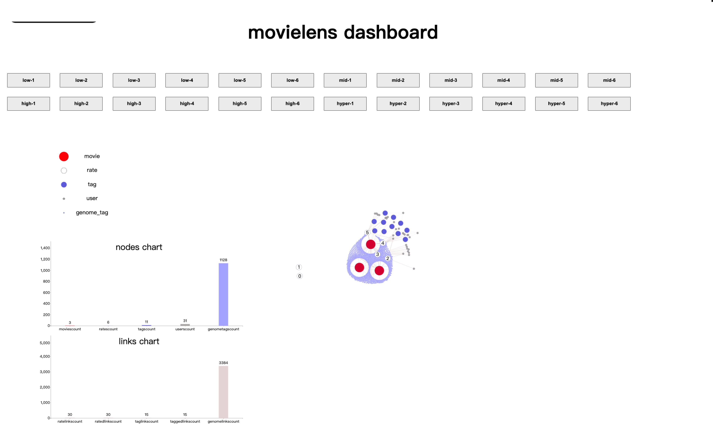
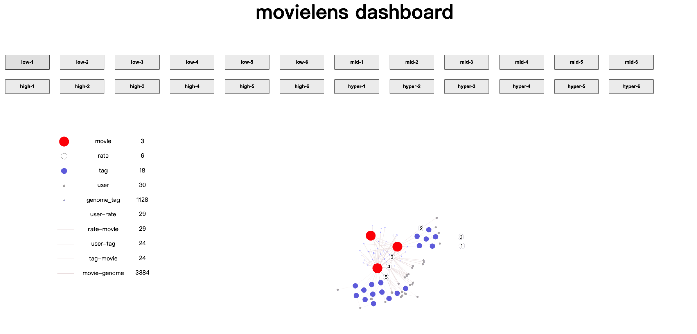
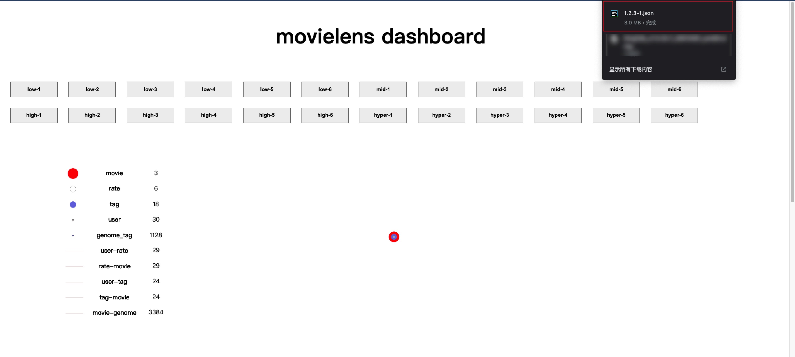

# MovieLens-Dynamic-Graph-VIsualization
基于movielens 数据集的数据处理及动态图可视化实验，在本地服务器上运行即可

## 数据说明：

所有的数据均放在./data 目录下

- ml-25m：原始数据集。（因为太大了所以删掉了，直接从下面的官网下载即可，并命名为ml-25m加入到data目录下）
  - 数据集具体介绍见：[MovieLens 25M Dataset](https://grouplens.org/datasets/movielens/25m/)
  - 数据集相关论文见：[PDF](http://files.grouplens.org/papers/harper-tiis2015.pdf)
- all1-2-3-xxxx：处理后数据集（包含坐标）
  - 和id为1，2，3的电影有关的评分信息、标签信息等
  - xxxx代表规模，本文分为4个规模，分别为 ```small ```，```mid```，```high```，```hyper```
  - 规模大小以时间间隔划分。每个打标签和评分信息都有打标签信息，数据集统计的时间间隔越大，就会有越多的评分和打标签行为，图中的节点也越多。从小到大分别为（100,300,800,2000)
- all1-2-3-xxxx-static：处理后数据集（包含坐标）
  - 用于提升渲染效率的数据集，直接显示节点迭代完后的最终位置，略去漫长的迭代过程，便于展示。
  - 注：先用`demo-dashboard makestatic.html`来生成数据，在用`demo-dashboard static.html`进行展示

## 代码说明

### 数据处理

- **data-process.py** ：数据处理py文件
  - `makeRatingDfByMovielist()`的参数是`movieId`，数据类型为list。如果你想看id为1，5，6三个电影的信息，那么参数就是[1,5,6]。这个函数的返回是三个`DataFrame`，一个是用户的评分数据，一个是用户的打标签数据。
- **requirements.txt** ：pip依赖，运行`pip install -r requirements.txt`

### dashboard1 - 可选择不同规模、不同时间片的数据进行展示

- demo-dashboard barcharts.html：包含统计信息（用柱状图显示）



- demo-dashboard iterating.html：不包含统计信息

  

### dashboard2 - 先迭代出一个布局结果，再将这个布局结果进行统一渲染

- **demo-dashboard makestatic.html**：点击数据源会缓存一份json数据，数据中的点包含最终坐标位置，可以直接渲染

  

- **demo-dashboard static.html**：渲染由`demo-dashboard makestatic.html`生成的节点坐标的数据集

  数据源不对请修改这部分代码：

  ```javascript
  d3.selectAll("button").on("click", function () {
    let filename = this.id
    let [dictionary, subGraphIndex] = filename.split('-')
    let filepath = "./data/all1-2-3-" + dictionary + "-static/1.2.3-" + subGraphIndex + ".json"
    console.log(filepath);
    draw(filepath)
  })
  ```

  

### 时间片比较

四个不同规模的数据，在六个相邻时间片中的变化情况

- **demo-svg-low.html**
- **demo-svg-mid.html**
- **demo-svg-high.html**
- **demo-svg-hyper.html**


